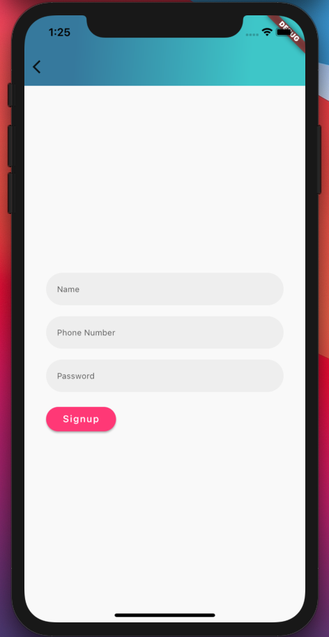
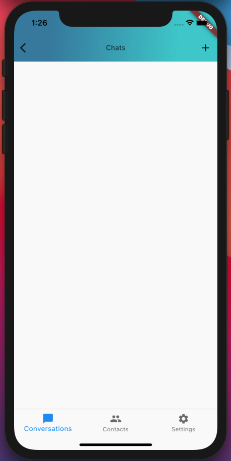
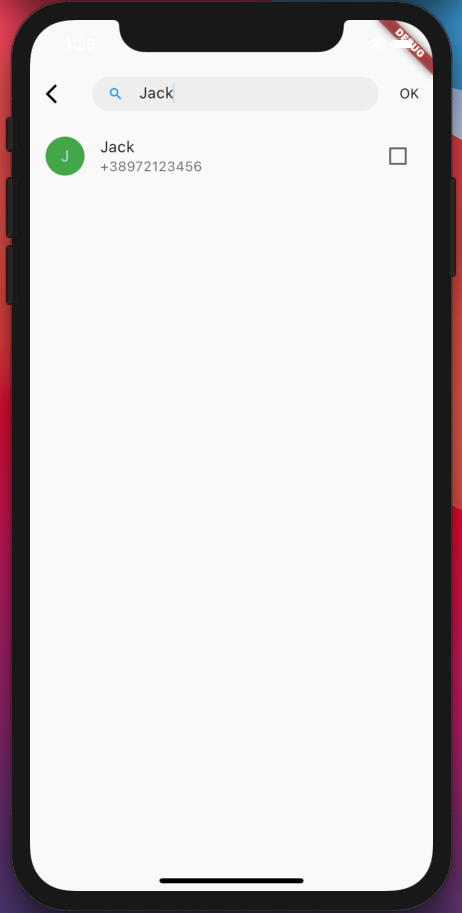
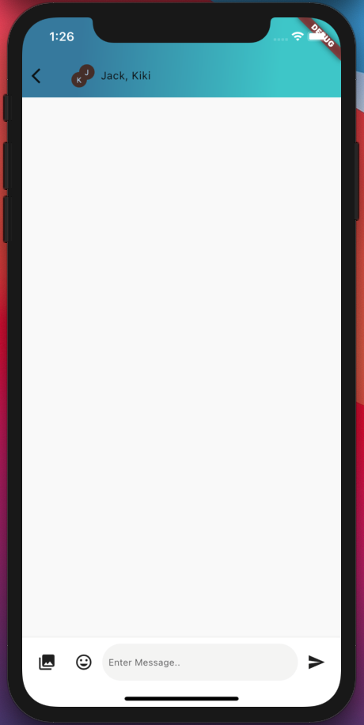

# chatty-flutter
## Flutter Messaging App using GraphQL and Provider

This Project is POC (Proof-of-concept) of building app Messaging application using technologies like **GraphQL**, **Provider** and etc.

Its to be used in conjunction with [this project](http://github.com/echonox/chatty-nodejs) which represents the backend/server side for this app

## Screenshots

## Demo

## Todos
* [x] Login Flow
* [x] Signup Flow
* [x] Logout Flow
* [x] List All Conversations
* [x] Start Conversation
* [x] Send Message
* [x] Delete Conversation
* [x] Settings Page
* [ ] Set Profile Photo (WIP)
* [ ] Send Emoji (WIP)
* [ ] Send Photos (WIP)
* [ ] Send Audio File
* [ ] Send Document File
* [ ] Invite Contact from Device (WIP)
* [ ] Organize Code
* [ ] Other ideas I don't remember now